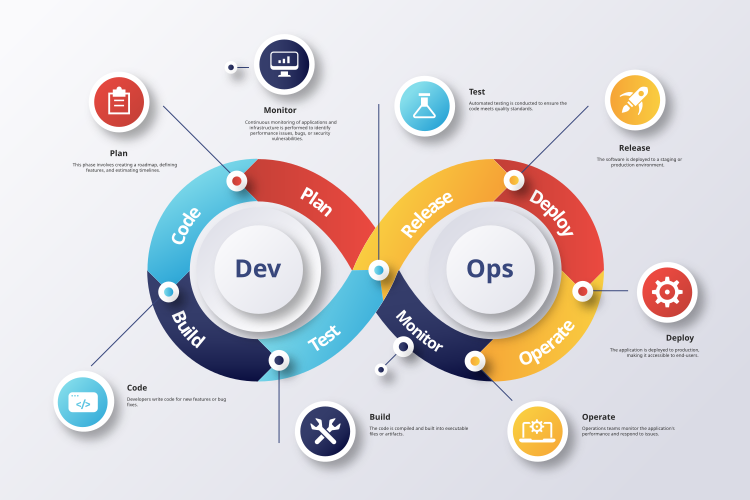

# Devops

Devops es un conjunto de prácticas que automatizan los procesos entre el desarrollo de software y la operación de software, con el objetivo de construir, probar y publicar software más rápido y de forma más confiable. Devops Tambien es la union de personas, procesos y tecnologias con el fin de porporcionar valor continuamente a los clientes.

A mi parecer con mi poca experiencia devops es una cultura que se adopta entre los equipos de desarrollo y operaciones para poder entregar software de forma mas rapida y confiable, es como la union de dos entes poderosos que individuales son buenos pero juntos son mejores. Algo interesante que acabo de comprender es que **dev** proviene de `development` y **ops** de `operations` y la union de estos dos es **devops**.

## Índice

1. [**Equipos**](#equipos)
    - [Desarrollo](#desarrollo)
    - [Operaciones](#operaciones)
1. [**Herramientas**](#herramientas)
    - [Control de versiones](#control-de-versiones)
    - [Integración continua / Entrega continua (CI/CD)](#integración-continua--entrega-continua-cicd)
    - [Contenedores](#contenedores)
    - [Monitoreo](#monitoreo)
1. [**Lifecycle**](#lifecycle)

## Equipos

### Desarrollo

- Desarrolladores
- QA
- Arquitectos
- Analistas

### Operaciones

- Administradores de sistemas
- Administradores de redes
- Administradores de bases de datos
- Administradores de seguridad

## Herramientas

### Control de versiones

- Git
- Github
- Gitlab
- Bitbucket

### Integración continua / Entrega continua (CI/CD)

- Jenkins
- CircleCI
- TravisCI
- Gitlab CI
- Bamboo

### Contenedores

- Docker
- Kubernetes
- Docker Swarm
- Mesos

### Monitoreo

- Grafana
- Prometheus
- Zabbix
- Nagios
- Datadog

## Lifecycle

