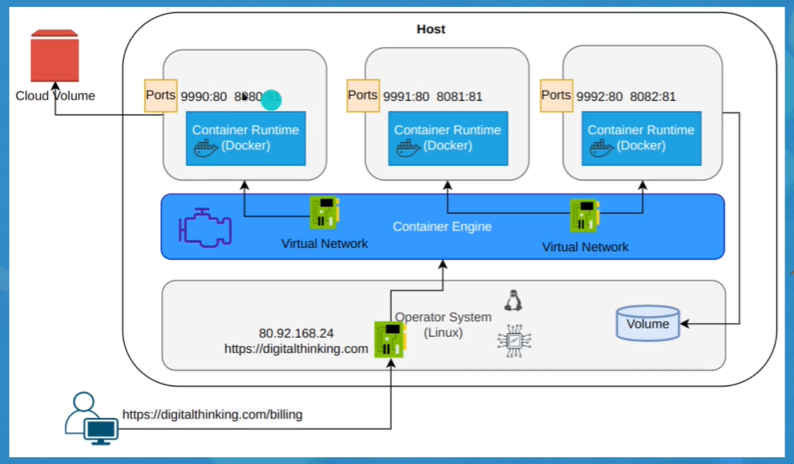

# 🐳 Docker

Docker es una plataforma de software que facilita la creación, prueba e implementación de aplicaciones. Empaqueta software en unidades estandarizadas llamadas contenedores, que incluyen todo lo necesario para que el software se ejecute. Esto permite una implementación y escalado rápido de aplicaciones en cualquier entorno.

## 📦 Contenedores

Los contenedores son una forma de empaquetar software para que pueda ejecutarse de manera confiable en diferentes entornos. Los contenedores de Docker utilizan virtualización a nivel de sistema operativo para ofrecer software empaquetado que se ejecuta en un sistema operativo host.

## 🖼️ Imágenes

Las imágenes de Docker son plantillas de solo lectura que contienen un conjunto de instrucciones para crear contenedores. Puedes crear tu propia imagen o usar imágenes creadas por otros y publicadas en un registro.

## 🚀 Docker Engine

Docker Engine es un motor de contenedores de código abierto que permite la creación y ejecución de contenedores de Docker. Puede ejecutarse en cualquier host compatible con Linux.

## ☁️ Docker Hub

Docker Hub es un servicio basado en la nube para compartir imágenes de contenedores y automatizar flujos de trabajo. Los desarrolladores utilizan Docker Hub para almacenar y compartir imágenes de contenedores, y para automatizar las compilaciones, pruebas e implementaciones de imágenes de contenedores.

## 📑 Docker Compose

Docker Compose es una herramienta para definir y ejecutar aplicaciones Docker de varios contenedores. Con Compose, utilizas un archivo YAML para configurar los servicios de tu aplicación. Para obtener más información, consulta la [lista de características](https://docs.docker.com/compose/overview/#features).

## 🐜 Docker Swarm

Docker Swarm es una herramienta de orquestación de clústeres y programación de contenedores nativa de Docker. Para obtener más información, consulta la [lista de características](https://docs.docker.com/engine/swarm/#features).

## 🖥️ Docker Machine

Docker Machine es una herramienta que permite instalar Docker Engine en hosts virtuales y administrar hosts de Docker de forma local o remota. Es la forma recomendada de instalar y ejecutar Docker en sistemas Mac y Windows.

## ⚓ Kubernetes

Kubernetes es una plataforma de código abierto para automatizar la implementación, el escalado y la administración de aplicaciones en contenedores. Para obtener más información, consulta la [lista de características](https://kubernetes.io/docs/concepts/overview/what-is-kubernetes/#why-you-need-kubernetes-and-what-can-it-do).

## 📊 Diagrama de Docker

